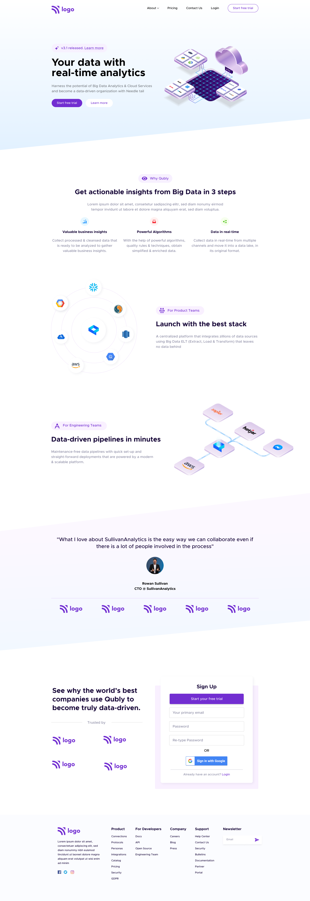

## Project-5 : 

### Output Obtained :
[Output Link](https://6466e2eacc80c92997dcc634--cheery-sunburst-3e2d49.netlify.app/)

### Desired output :

`Note : this project is not responsive it is just made to practice replicating a design using css`