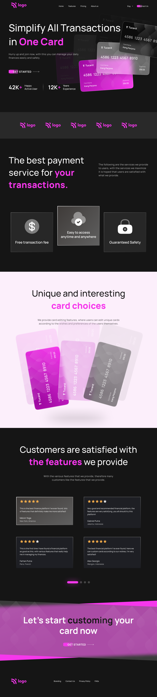

## Project-1 : 

### Output Obtained :
[Output Link](https://6460fad60c7e9612e928113f--capable-cuchufli-b03c63.netlify.app/)

### Desired output :

`Note : this project is not responsive it is just made to practice replicating a design using css`