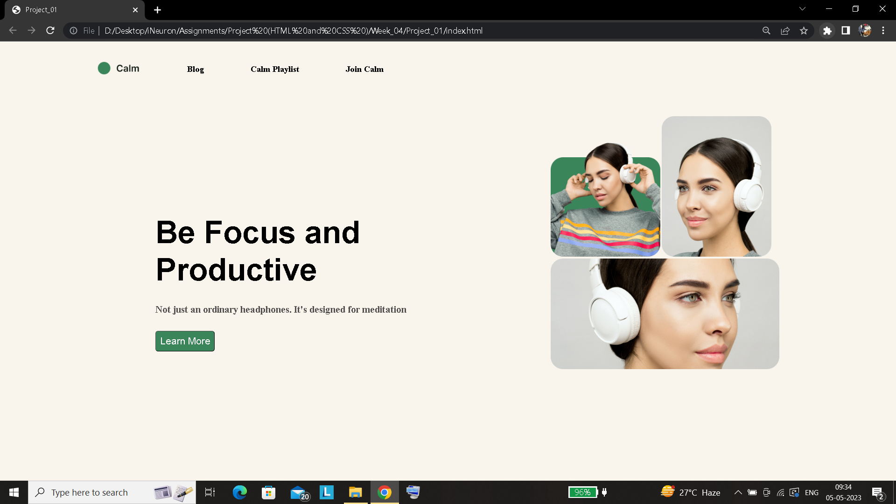

### This folder contains three projects (Week 04) based on **HTML and CSS** 

---
## Project_01 :
### Desired output :

### Output obtained :

[Output file to Project_01](./Project_01/index.html)

---

## Project_02 :
### Desired output :

### Output obtained :

[Output file to Project_02](./Project_02/index.html)

---

## Project_03 :
### Desired output :

### Output obtained :

[Output file to Project_03](./Project_03/index.html)

`Note: All folders have respective output files as mentioned also these projects are not responsive they are just made to practice replicating a design using css`